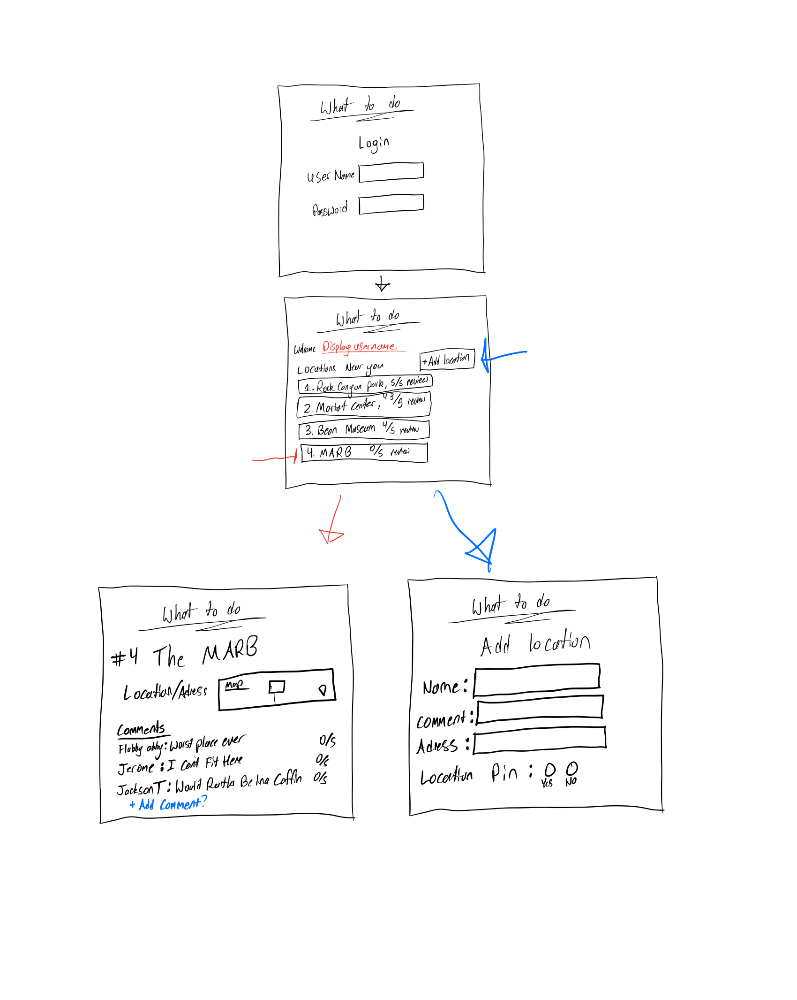

# Startup: What to Do

## Specification Deliverable

### Elevator pitch

Have you ever wanted to try something new but didn't know where to go to do it? With my new websight "What to Do" you get acces to every loved and favorite place in the area. You can check locations out for yourself and leave a comment on if youd recomend taking the trip. Help other people to have a fun night by adding new location that you discover, you never know maybe you will discover the next big hit.

### Design

This websight has 3 main pages:
    1st - There is the login Page
    2nd - There is The browing page which diplays nearby locations
    3rd - There is the adding location page which will grab your location or an adress and create a new page for that location.

### Key features

- Secure login over HTTPS
- Display of multiple locationsbased on distance and reviews
- Ability to comment and review places
- Ability to add new location

### Technologies

I am going to use the required technologies in the following ways.

- **HTML** - Basic structural and organization of websight
- **CSS** - Styling and animating page changes
- **JavaScript** - Interactivity, switching pages and allowing you to click on buttons
- **Web Service** - Remote functions that pulls from data base of locations and reviews
- **Authentication** - Creating accounts and logging in
- **Database persistence** - Storing user data in a database - stores comments and reviews
- **WebSocket** - Will store the comments and upload them to server
- **Web Framework** - Using React to add components and request routing

## HTML deliverable

For this deliverable I built out the structure of my application using HTML.

- **HTML pages** - Four HTML pages for login, browsing, viewing, and adding.
- **Links** - switches page
- **Text** - comments will be displayed via text
- **Images** - This will show a picture of the location